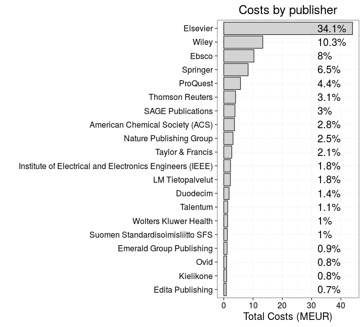
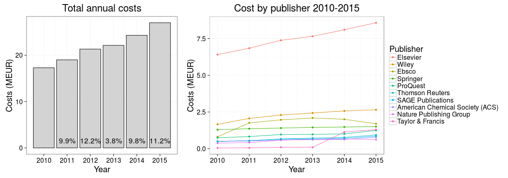
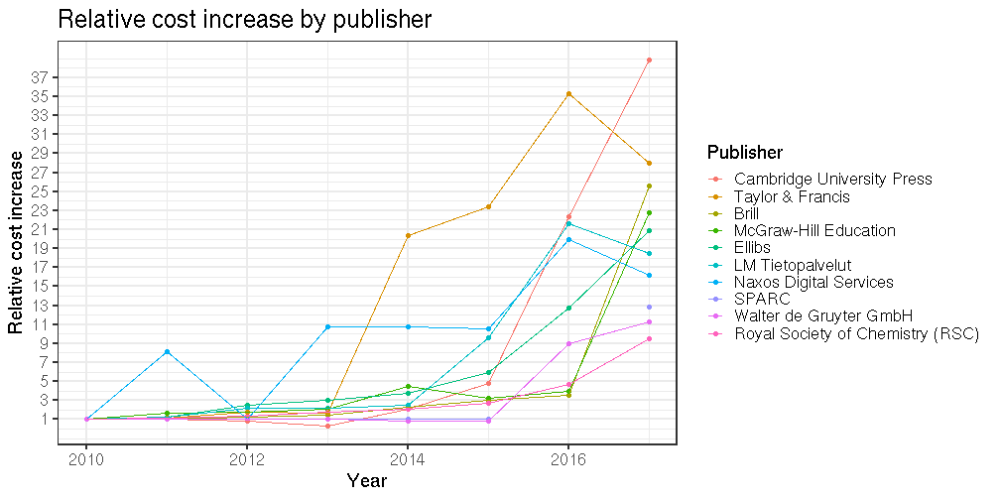
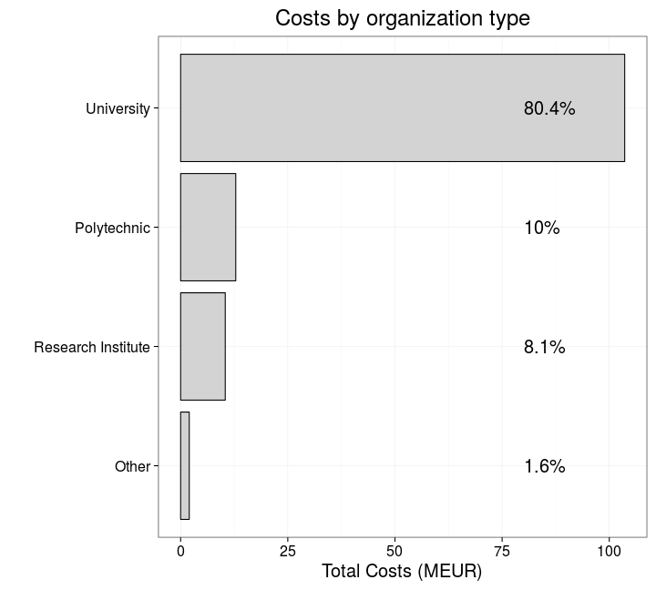
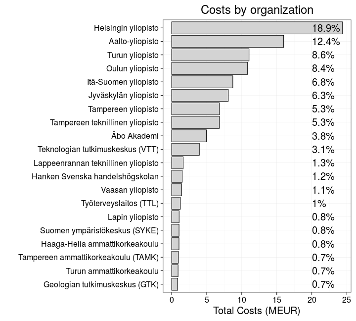
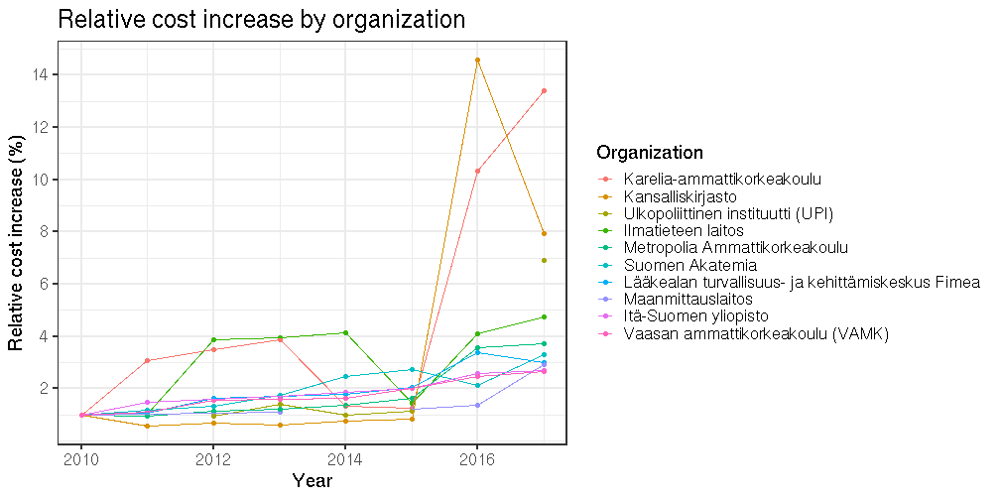

# Subscription costs to scientific publishers in Finland 2010-2017

Leo Lahti (Dec 3, 2018) 


This is an updated version of the analysis posted in the [rOpenGov blog](http://ropengov.github.io/r/2016/06/10/FOI/). For the analysis source code, see [main.R](main.R) in this repository.

The data ([Publisher Costs in Finland 2010–2017](http://urn.fi/urn:nbn:fi:csc-kata20160609091336769027)) is being collected and maintained by [avointiede.fi](https://avointiede.fi/fi/avoimet-julkaisut/kustantajahintatietoja), and was initially provided by Finnish Ministry of Education and Culture, and its Open Science and Research Initiative funded 2014–2017.

I have abbreviated some terms as detailed in the source code. Pull
requests for additional analyses are welcome and will be acknowledged
appropriately.


## Overall subscription costs 2010-2017


Based on the data collected by the Ministry of Education, Finland paid in total
198.7 million EUR subscription and other
fees on scientific publishing in 2010-2017. The average annual costs for in Finland were 25 MEUR in 2010-2017.

Data for the top-10 publishers in the UK 2010-2014 is available in [Lawson, Meghreblian & Brook, 2017](https://olh.openlibhums.org/articles/10.16995/olh.72/#B45) ([Table 1](https://olh.openlibhums.org/articles/10.16995/olh.72)). During this period the UK paid altogether 4319 MEUR (rough estimate based on the exchange rate June 12, 2016) for the top-10 publishers. Finland paid 62 MEUR for the same top-10 publishers in 2010-2014. This is  17.1% of the UK expenditure _per capita_. It could be that the data is not directly comparable but this will require further investigation. 


Information for Finland is available by [agreement
type](table/cost_by_type.csv), organization type, and [subscription
category](http://data.okf.fi/ropengov/20160613-FOI/dashboard.html).


### Costs by publisher

Overall, the Finnish data covers 376 publishers ([see annual costs by publisher](http://data.okf.fi/ropengov/20160613-FOI/dashboard.html). The left figure indicates the total subscription fees paid to the top publishers 2010-2017. Over one third of the total costs go to Elsevier, which has been often [criticized](https://gowers.wordpress.com/2014/04/24/elsevier-journals-some-facts/) for its huge [profit margins](http://journals.plos.org/plosone/article?id=10.1371%2Fjournal.pone.0127502). The costs are given per bundle, so we cannot compare average journal prices among individual publishers based on this data.




The total costs paid to scientific publishers by Finland have increased roughly 10% per year in 2010-2017 (annual increase is indicated in the left figure). The top-10 publishers correspond to 75% of the overall costs (right figure). See a separate table for full [annual costs by publisher](http://data.okf.fi/ropengov/20160613-FOI/dashboard.html). 




Let us compare the [relative increase in publisher costs](http://data.okf.fi/ropengov/20160613-FOI/dashboard.html). The costs are normalized to 1 in 2010, and the top 10 publishers with the highest cost increase in 2010-2017 are shown. The 275 publishers that did not have declared costs in 2010 or 2017 (see [here](http://data.okf.fi/ropengov/20160613-FOI/dashboard.html)) are excluded.


```
## Warning: Removed 1 rows containing missing values (geom_point).
```




### Costs by organization


The Finnish data collection includes 82 organizations ([see annual costs by organization](http://data.okf.fi/ropengov/20160613-FOI/dashboard.html)). The universities ('yliopisto') are responsible of NA% of all costs (left figure); University of Helsinki had the highest total costs in 2010-2017 (37.9 MEUR; top institutions shown in the right figure).




Finally, let us compare the [relative increase in costs across the institutions](http://data.okf.fi/ropengov/20160613-FOI/dashboard.html). The costs are normalized to 1 in 2010, and the top 10 organizations with the highest cost increase in 2010-2017 are shown. The 34 organizations that did not have declared costs in 2010 or 2017 (see [here](http://data.okf.fi/ropengov/20160613-FOI/dashboard.html)) are excluded.


```
## Warning: Removed 3 rows containing missing values (geom_point).
```


